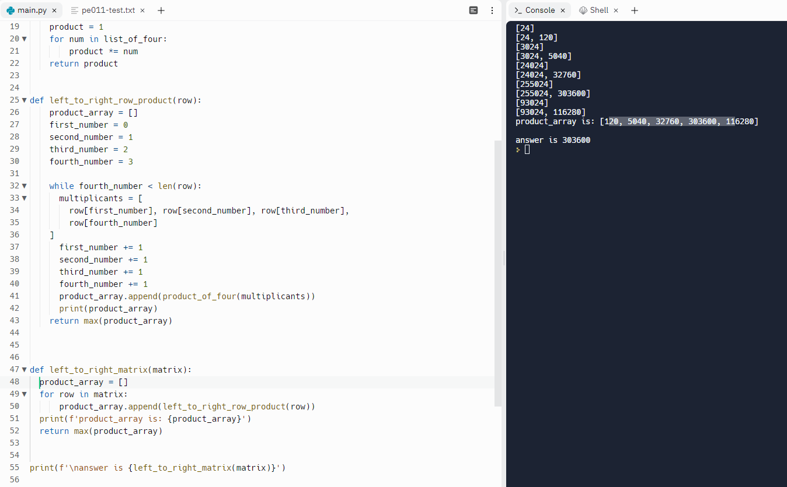

# 2022-09-25
## First journal entry for project Euler: Learning markdown

This is the first entry into a journal I'm developing to compile project euler learnings. The first step in this process is to learn how to use markdown in VScode!
To that end, I've been researching how to use markdown. I'm a bit familiar with the headers that can be used (see above), but I"m unsure about how to actually visualize what I"m working on (what does the final markdown look like?). I can see the final product in github, but I guess I'll need to search further or ask a friend.


As an experiment, here is a picture that I hope shows up in github of a recent project euler problem that I was solving with friend:
[First picture](./pictures/pe011.png)

It looks like that was just a link (although I can see the image if I click the link.)
Here is what happens when I literally drag and drop. This requires opening explorer to my working folder and then dragging from the pictures folder in my learning journal:

[First picture again](pictures/pe011.png)

A bit of googling showed me that I can actually visualize the final markdown product if I hit (Ctrl+Shift+v). This also revealed that dragging and dropping images doesn't accomplish what I intended. If this is set in a new window on the right hand side, it actually looks really nice! Alternatively, press (Ctrl +K ... and then V).

In the meantime, lets see what blocks look like (using this symbol: ">"):
> block 1
>> block 2
>>> block 3

I also realized that in addition to being able to display images, I should also be able to display code snippets. With those two things, I think will have everything I need to have a good working journal.


Behold! all you need to do is add an exclamation mark before: [picture name](filepath)


Table test:
| Syntax      | Description |
| ----------- | ----------- |
| Header      | Title       |
| Paragraph   | Text        |


~~Strike through test~~

Finally I found out how to generate a codeblock (using three ` before and after the code):
```
This is a code block attempt:

```

This is great! this means that I can finally copy and paste python code into this markdown journal. For example, here is the code that friend and I were using for problem 11:

```
def horizontal_row_product(row):
    product_array = []
    first_number = 0
    second_number = 1
    third_number = 2
    fourth_number = 3

    while fourth_number < len(row):
        multiplicants = [
            row[first_number], row[second_number], row[third_number],
            row[fourth_number]
        ]
        first_number += 1
        second_number += 1
        third_number += 1
        fourth_number += 1
        product_array.append(product_of_four(multiplicants))
        print(product_array)
    return max(product_array)
```

What would be kind of neat is to see this same code with the appropriate color scheme.


There is an answer for everything! All you need to do is to add the word 'python' after the three initial backticks! (it looks like 'py' accomplishes this as well!)
```py
def horizontal_row_product(row):
    product_array = []
    first_number = 0
    second_number = 1
    third_number = 2
    fourth_number = 3

    while fourth_number < len(row):
        multiplicants = [
            row[first_number], row[second_number], row[third_number],
            row[fourth_number]
        ]
        first_number += 1
        second_number += 1
        third_number += 1
        fourth_number += 1
        product_array.append(product_of_four(multiplicants))
        print(product_array)
    return max(product_array)
```

**Excellent**

Now I can make some awesome journal entries to catalogue my learnings!
