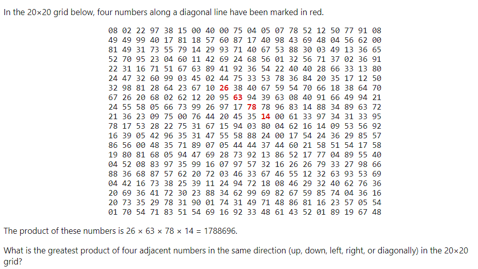

# Project Euler #11: Largest product in a grid



## Initial Design:
1) Copy the 20x20 grid of numbers into a format that python can access (a 2-dimensional list)
2) Define a function to calculate the product of 4 numbers horizontally
3) Define a function to calculate the product of 4 numbers vertically
4) Define a function to calculate the product of 4 numbers by both diagonals
5) Find the maximum of all products as our answer


# Progress
## Reading data into a 2-dimensional list
Initially, the matrix was defined using the code below. 

```py
f = open("pe011-test.txt")
contents = f.read()
f.close()

rows = (contents.split('\n'))

matrix = []
for row in rows:
    matrix.append([int(num) for num in row.split(' ')])
```
You can see that we read in a txt file and split rows by new line (generating an array of numbers separated by a space). That could then be further split and appended into an empty array using list comprehension.

This gave us the following (using a small 5x5 testcase matrix):
```
Out[66]: 
[[1, 2, 3, 4, 5],
 [6, 7, 8, 9, 10],
 [11, 12, 13, 14, 15],
 [21, 22, 23, 24, 25],
 [16, 17, 18, 19, 20]]
 ```

 ## Horizontal product function
 ```py
 def product_of_four(list_of_four):
    product = 1
    for num in list_of_four:
        product *= num
    return product


def horizontal_row_product(row):
    product_array = []
    first_number = 0
    second_number = 1
    third_number = 2
    fourth_number = 3

    while fourth_number < len(row):
        multiplicants = [
            row[first_number], row[second_number], row[third_number],
            row[fourth_number]
        ]
        first_number += 1
        second_number += 1
        third_number += 1
        fourth_number += 1
        product_array.append(product_of_four(multiplicants))
        print(product_array)
    return max(product_array)


def horizontal_matrix(matrix):
    product_array = []
    for row in matrix:
        product_array.append(horizontal_row_product(row))
    print(f'product_array is: {product_array}')
    return max(product_array)
```
Output:
```
[24]
[24, 120]
[3024]
[3024, 5040]
[24024]
[24024, 32760]
[255024]
[255024, 303600]
[93024]
[93024, 116280]
product_array is: [120, 5040, 32760, 303600, 116280]

answer is 303600
```
For each row in our 2-D array, we can identify 4 numbers. The while-loop allows us to actually identify these numbers for each row, advancing each number by 1. 1st number, 2nd number, etc are actually better labeled as 1st **index**, second **index**, which would eliminate some ambiguity.

Calling the horizontal_matrix function was met with an error. We had mistakenly had product_array = [] inside of the for loop. This gave us only the maximum for the last array in our 5x5 test grid.

The mistake:

```py
def horizontal_matrix(matrix):    
    for row in matrix:
    product_array = []
        product_array.append(horizontal_row_product(row))
    print(f'product_array is: {product_array}')
    return max(product_array)

```
mistake output:
```
[24]
[24, 120]
[3024]
[3024, 5040]
[24024]
[24024, 32760]
[255024]
[255024, 303600]
[93024]
[93024, 116280]
product_array is: [116280]

answer is 116280
```
 ## Horizontal product function
 