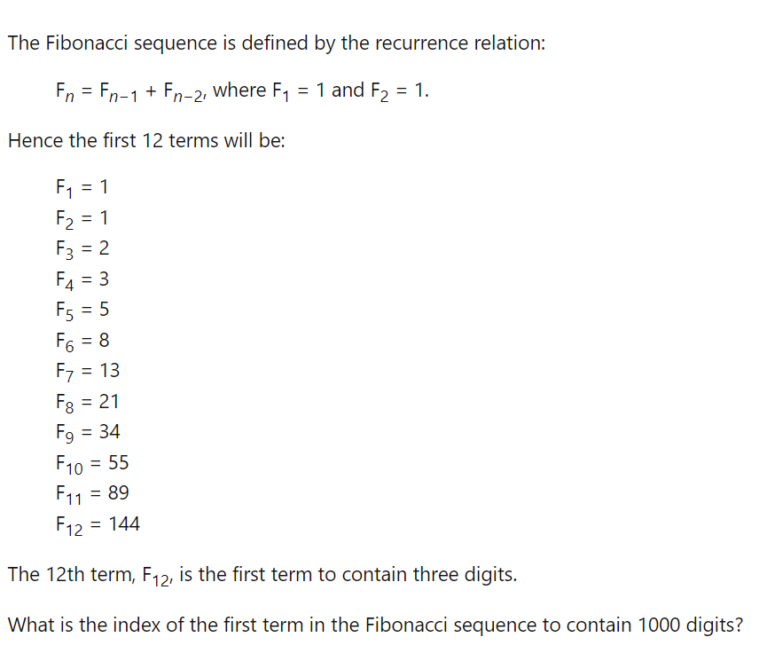

# 2022-10-09
## 1000 digit Fibonacci number



## Design
The design process was a bit unconventional this time around. Rather than mapping out what we wanted to do, we instead prioritized writing a function that could handle extremely large numbers. Although python can store 1000-digit numbers, other languages cannot. Furthermore, this would be a cool opportunity to learn how to add two strings (which can apparently be stored more easily?)

To that end, the priority became: how can we add two strings, digit by digit? This was achieved by first setting up an example of the problem being solved:
```
scenario:
-11-    (numbers carried over)
-456    (456 is "string1")
-789    (789 is "string2")
----
1245    
```

This problem could thus be solved by first adding 6 and 9, and then carrying over the 1 to the tens place...

## The function add_2_strings
Unfortunately I did not record our iterations of this function. One of the initial versions was:
```py
def add_2_strings(str1, str2):
    counter1 = len(str1) - 1
    counter2 = len(str2) - 1
    answer = ''
    carry = 0

    while counter1 >= 0:
        digit1 = int(str1[counter1])
        digit2 = int(str2[counter2])
        digit_sum = str(digit1 + digit2 + carry)
        digit = digit_sum[1] if len(digit_sum) > 1 else digit_sum[0]
        carry = int(digit_sum[0]) if len(digit_sum) > 1 else 0
        answer = digit + answer
        counter1 -= 1
        counter2 -= 1
    answer = str(carry) + answer if carry != 0 else answer
    return answer
```
## Interesting learnings
We first wrote out the while loop with the condition that we wanted to iterate through the **longest** number (by number of digits). The code would add up the last digit using a counter to capture the desired index (last digit first, working our way to the beginning of the number).
1. The digit_sum needed to add both of the digits, as well as the carryover (if any! This was also initialized to zero since the first digit addition would never have any carryover). However, we needed the code to recognize when there was carryover. Thus, we used a ***TERNARY OPERATOR***
   * *carry* was therefore set to equal the first digit of digit_sum only if the length of digit_sum was greater than 1 (for example, the number 15)
2. Another lesson was quite simple actually. Rather than addint digits to the end of an answer number, we needed to add them to the beginning using: answer = digit+ answer
3. We also ran into the issue where the the first number of a sum was ommitted if there was any carryover. Since carry is only added in the **next** addition, the final digit addition never had its first digit. This was resolved by setting up another ternary operator that said that the final answer was equal to the carryover + answer only if carryover did not equal 0.


## Final iteration of our function
The final version of our function modified the code to accomodate situations where the numbers had different numbers of digits:
```py
def add_2_strings(str1, str2):
    # str1 is intended to be the longer string
    temp1 = str1
    temp2 = str2
    if len(str1) < len(str2):
        str2 = temp1
        str1 = temp2

    counter1 = len(str1) - 1
    counter2 = len(str2) - 1
    answer = ''
    carry = 0

    while counter1 >= 0:
        digit1 = int(str1[counter1])
        digit2 = 0 if counter2 < 0 else int(str2[counter2])
        digit_sum = str(digit1 + digit2 + carry)
        digit = digit_sum[1] if len(digit_sum) > 1 else digit_sum[0]
        carry = int(digit_sum[0]) if len(digit_sum) > 1 else 0
        answer = digit + answer
        counter1 -= 1
        counter2 -= 1
    answer = str(carry) + answer if carry != 0 else answer
    return answer
```

## Putting it all together

```py
fibonacci_index = 2
next_fib_num = ''
F1 = '1'
F2 = '1'
while len(next_fib_num) < 1000:
    next_fib_num = add_2_strings(F1, F2)
    F1 = F2
    F2 = next_fib_num
    fibonacci_index += 1

print("fibonacci_index")
print(fibonacci_index)
print(next_fib_num)
```
With our function in hand, the problem became quite easy. We would assign two fib numbers to "1" and "1" (both strings), and then set a while loop with the condition of achieving a fibonacci number of 1000 digits. The code would then advance F1 to F2, and F2 to the next fib_num. The fibonacci index would increase by 1. This gave us out final answer of **4782**!

One of the cool learnings here was how to "calibrate the code". We knew from the question that a fibonacci index of 12 should give us our first 3 digit number.