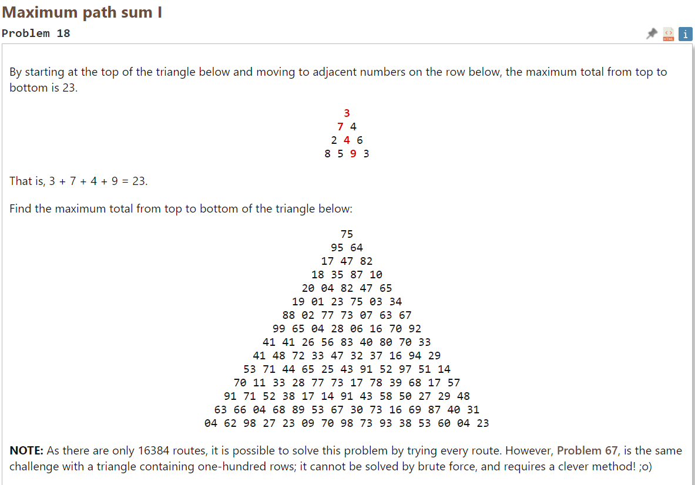
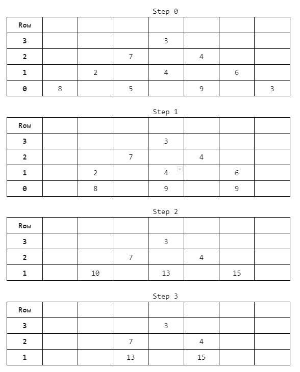

# 2022-10-17
# Optimal Path Sum 1



On Saturday we worked through the above problem. It was pretty clear to me that we needed to start from the bottom and work our way up, but how exactly was not clear.



My friend showed me the above design divided into a number of repeating steps.
- Step 1: Find the greatest number between each pair of numbers, iterating through the row one by one
- Step 2: Now that the bottom two rows are of equal length, add them up
- Step 3: repeat

Ultimately, the code we came up with is as follows:
```py
with open("pe018-data.txt") as file_object:
    contents = file_object.read()

rows = (contents.split("\n"))

triangle = []
for row in rows:
    triangle.append(list(map(int, row.split(" "))))


row_counter = len(triangle) - 1
firstRow = 0
optimal_paths = []

while row_counter > firstRow:
    counter = 0
    if row_counter == len(triangle) - 1:
        current_row = triangle[row_counter]
    else:
        current_row = optimal_path_sum
    optimal_path = []
    while counter < len(current_row) - 1:
        larger_number = current_row[counter] if current_row[
            counter] > current_row[counter + 1] else current_row[counter + 1]
        optimal_path.append(larger_number)
        counter += 1
    optimal_path_sum = [x + y for x, y in zip(optimal_path, triangle[row_counter - 1])]
    optimal_paths.append(optimal_path_sum)
    row_counter -= 1
print(optimal_paths)
```

## Learnings
- I read in the data as a txt file using what I had learned from Crash course. Specifically the code: ``` with open(file) as object: contents = object.read()```. Also useful was the ability to split by newline, and then split by space. What I did not know how to do was how to turn each number from a string into an integer. ```list(map(int, row.split(" ")))```. According to the internet, map() function returns a map object (an iterator) of the results after applying the function to each item of a list. I guess the function here is int().
- I'm getting more used to while loops. It's nice to set up a counter outside the loop, modify the counter within the loop. There is also more freedom to count down, count up, use the counter for other purposes (like an index) etc.
- We used a ternary operator for determining the highest value between pairs.
- Using the zip() function is something interesting! The result is a list of tupples when zipping two or more lists. Thus, ```x+y for x,y in zip(two rows)``` makes sense. I also think this is what unpacking tupples means?
- We got stuck when we could not figure out how to get the code to recognize that our summed row was the next "current row". This was resolved by the if-else statement. What's itneresting is that the optimal_path_sum variable doesn't exist until after a single iteration of the while loop. 

