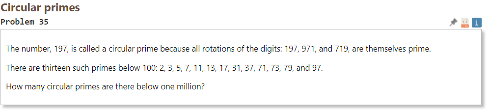

# 2022-10-31
# Circular Primes

For this problem I"m going to keep this journal open to record any challenges I meet along the way. I think I missed some learnings from the last problem by not being on top of recording my struggles!

OK, here's something tricky for me:
```py
def number_rotator(number):
    for rotation in range(len(str(number))):
        number = int(str(number)[1:] + str(number)[0])
        if prime_dic[number] == True:
            pass
        else:
            break
        print(f'{number} is rotatable prime')
number_rotator(97)
```
```
output
79 is rotatable prime
97 is rotatable prime
```
How can I tell the script that in order for a number to be rotatable prime, then ALL rotations must be prime? Should I do this with a flag?

Using a flag method we get:
```py
def number_rotator(number):
    rotatable = False
    for rotation in range(len(str(number))):
        number = int(str(number)[1:] + str(number)[0])
        if prime_dic[number] == True:
            rotatable = True
        else:
            rotatable = False
            break
    return rotatable
print(number_rotator(53))
print(number_rotator(13))
```
This is nice and clear. For every iteration, if prime, "rotatable" will be True and ultimately a True value will be returned. However, if at ANY point, a rotation is NOT prime, then rotatable is turned to False, and the for loop is exited!

The following code is wrong:
```py
upper_limit = 1000000
counter = 0
answer = 0

def find_prime_number(upper_limit):
  # Returns boolean array of size upper_limit that states if the number is prime or not
  starting_point = 2
  is_prime = [True]*upper_limit

  while starting_point < upper_limit:
    multiple = starting_point
    while multiple < upper_limit:
      multiple += starting_point
      if multiple < upper_limit:
        is_prime[multiple] = False
    starting_point += 1

  return is_prime

prime_boolean_array = (find_prime_number(upper_limit))

prime_dic = dict(zip(list(range(0,upper_limit)),prime_boolean_array))
prime_dic[0] = False
prime_dic[1] = False

def number_rotator(number):
    rotatable = False
    for rotation in range(len(str(number))):
        number = int(str(number)[1:] + str(number)[0])
        if prime_dic[number] == True:
            rotatable = True
        else:
            rotatable = False
            break
    return rotatable
print(number_rotator(53))
print(number_rotator(13))


rotatable_prime_list = []

def circular_prime_number(prime_numbers_array):
    for number, prime_status in prime_numbers_array.items():
        if prime_status == True:
            if number_rotator(number) == True:
                rotatable_prime_list.append(number)

circular_prime_number(prime_dic)        

print(rotatable_prime_list)   
print(len(rotatable_prime_list))  
#129
```
I think this might be because of how zeros are handled. The number rotator would take in a number like 100 and return 001, 010.
Even more dramatic is how 101 is handled in which the script evaluates the number 11 three separate times (rather than 101, 11, and 110). My answer of 129 is likely inaccurate because of this issue.

I ended up fixing the issue by keeping the number as a string until it needed to be evaluated as to whether or not it was prime:
```py
def number_rotator(number):
    rotatable = False
    for rotation in range(len(str(number))):
        number = str(number)[1:] + str(number)[0]
        print(number)
        if prime_dic[int(number)] == True:
            rotatable = True
        else:
            rotatable = False
            break
    return rotatable
(number_rotator(101))
```
In this case, 101 evaluated to false (which is what I wanted). The issue is that int(011) collapses to 11 which is then fed back into the for loop, causing prime evaluations of 11 a couple more times!

turns out that the answer is 35!