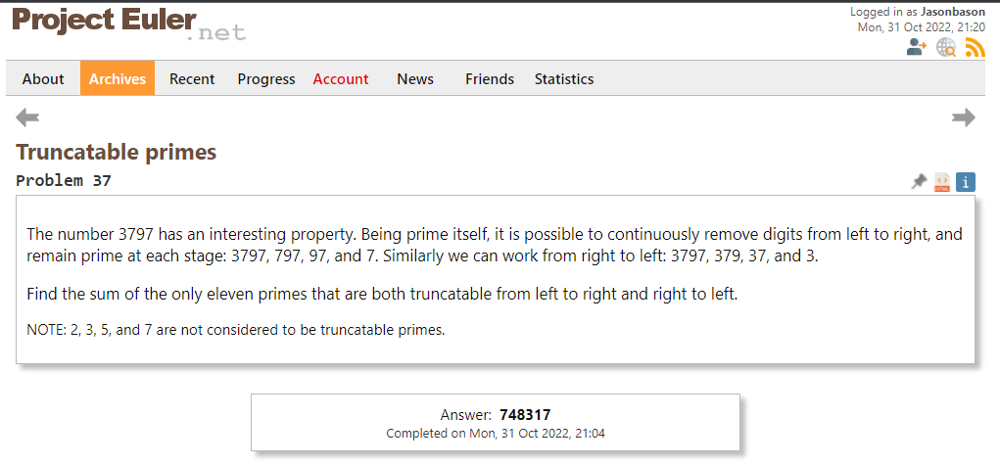

# 2022-10-31
# Truncatable primes


In this problem, I was using the is_prime function (We changed the name to reflect the fact that a boolean was returned here) in conjunction to three new functions. The whole code is as follows:

```py
# q: Truncatable Primes
# 1. Generate an array of prime numbers up to upper_limit
# 1.1 Use for-loop / counter: loop over array. If counter is prime, check if truncatable prime
# 2.1 If number is not prime, advance to the next number
# 2.2 If number is prime run through left-truncation function and right-truncation function
# 2.2.1 left-truncation function: convert number into a string
# while [num=prime && num>0]
# delete left most digit
# if new num not prime, skip to next index

upper_limit = 1000000
counter = 0
answer = 0


def is_prime(upper_limit):
    # Returns boolean array of size upper_limit that states if the number is prime or not
    starting_point = 2
    is_prime = [True] * upper_limit

    while starting_point < upper_limit:
        multiple = starting_point
        while multiple < upper_limit:
            multiple += starting_point
            if multiple < upper_limit:
                is_prime[multiple] = False
        starting_point += 1

    return is_prime


is_prime = is_prime(upper_limit)
# Manually convert 0 and 1 to prime numbers
is_prime[0] = False
is_prime[1] = False

def is_truncatable_prime(number):
    if left_truncation(number)==True:
        if right_truncation(number) == True:
            print(f"{number} is truncatable")
            return True
        else:
            return False
    else:
        return False

def left_truncation(number):
    while number > 0 and is_prime[number] == True:
        number = str(number)
        number = int(number[1:]) if int(number) >=10 else -1
        if number == -1:
            return True
            

def right_truncation(number):
  while number > 0 and is_prime[number] == True:
    number = number //10
    if len(str(number)) == 1 and is_prime[number] == True:
        return True


primes_dict = dict(zip(list(range(0,upper_limit)), is_prime))

truncatable_primes = []
for i,v in primes_dict.items():
    if v == True:
        if is_truncatable_prime(i) == True and len(str(i)) >=2:            
            truncatable_primes.append(i)

print(sum(truncatable_primes))
#748317
#test2
```

## Learnings
- I tried employing a dictionary for this task as you can see towards the bottom with ```dict(zip(list(range(0,upper_limit)),is_prime))```. This is kind of neat: the dict function takes in **kwargs. Crash course says that these are "arbitrary key-value pairs". In my case, I wrapped the dict function around a zip function, which you can pass two lists to to get a single iterator. The lists were another list from the range function and the is_prime boolean array. This got me a huge dictionary that defined whether or not a number was prime. However, I then had to manually update the is_prime boolean so that indices 0 and 1 were False.
- The left_truncation function was easy enough. By turning a number into a string, you can slice away the first character. The challenge here was in how we stopped the function. This was done by setting the condition for a positive number, while turning a single digit number into a negative value. I also had to kind of cheat by saying that if the number manages to reach -1 (which should only happen if the final single digit number is prime), then the value is set to -1 and the  function returns True. My friend said that my code should be very leggible, and this might be an instance where arbitrary values (-1) could be confusing for me later on.
-